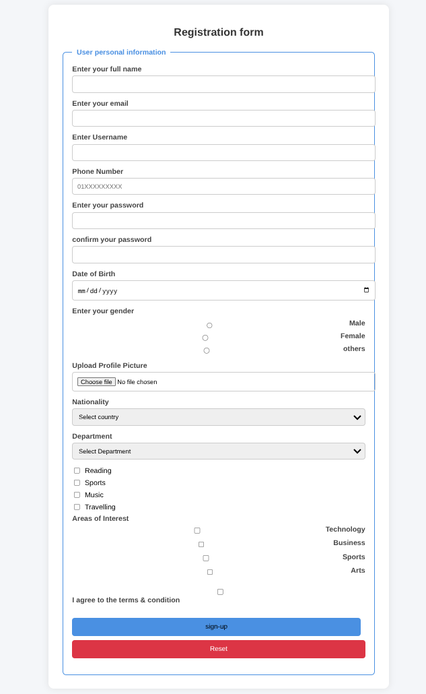

# Registration Form

A clean and interactive user registration form featuring advanced input types and custom styling.

## Preview

## What I Learned
- Utilizing fieldsets and legends for form grouping
- Implementing form validation concepts (placeholder, required fields)
- Designing interactive hover and focus states with CSS

## Files
- `Registration_Form.html` - Registration form structure
- `Registration Form.css` - Custom styling for the form